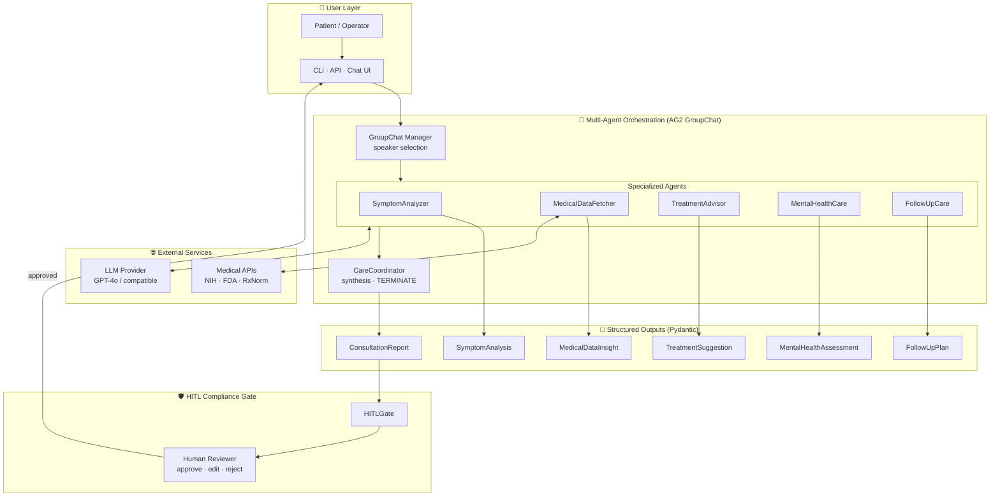
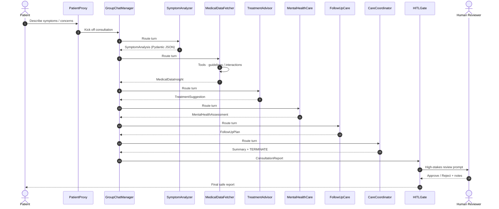
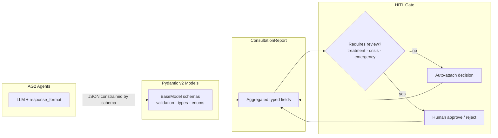
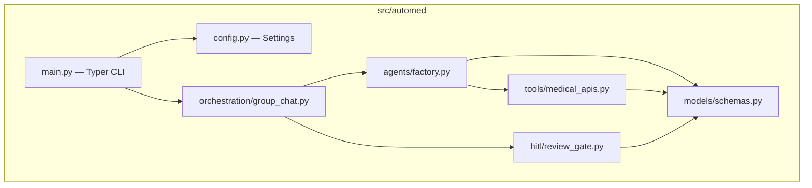
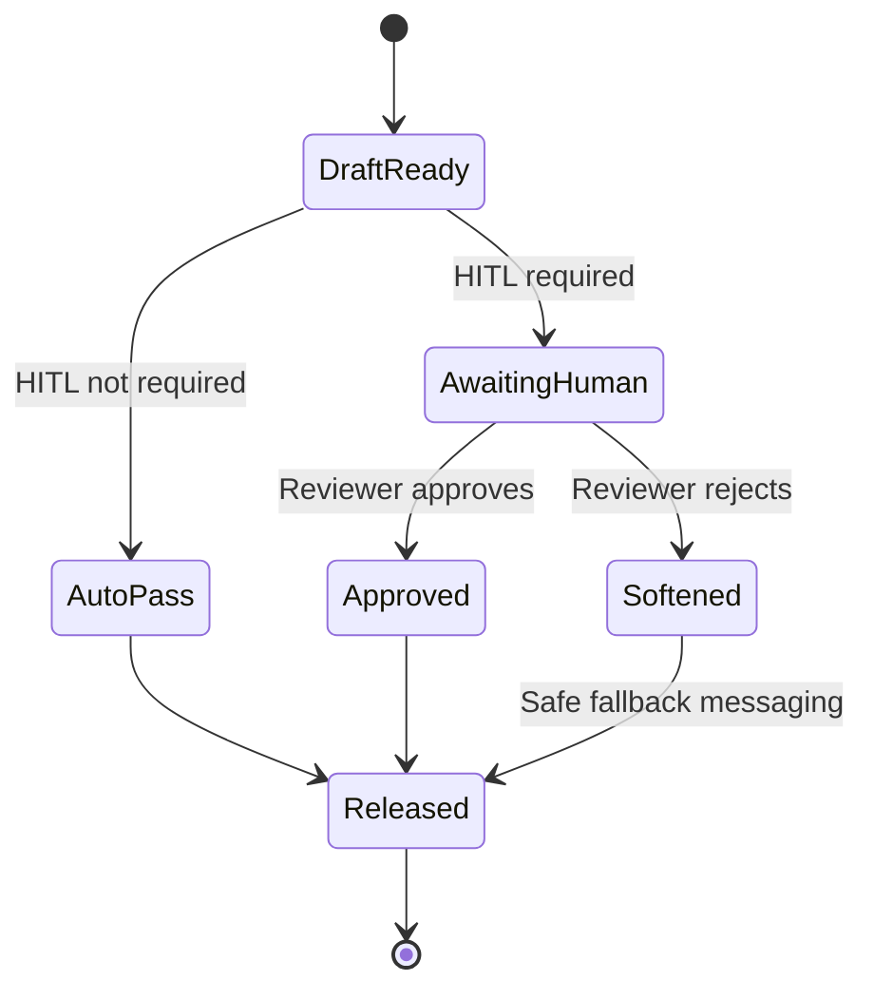

# AutoMed — Multi-Agent Healthcare Assistant with AG2 (AutoGen)

> Intelligent, collaborative medical consultation powered by **multi-agent orchestration**, **Pydantic structured outputs**, and **Human-in-the-Loop (HITL)** compliance gates.

[](https://www.python.org/downloads/)
[-0A7B83.svg)](https://docs.ag2.ai/)
[](https://docs.pydantic.dev/)
[](#3-human-in-the-loop-hitl)
[](LICENSE)

---

## Disclaimer

**AutoMed is an educational / research multi-agent system.**  
Guidance produced by this project is **not** a substitute for professional medical consultation, diagnosis, or treatment. Always seek care from a qualified healthcare professional. In an emergency, contact local emergency services immediately.

---

## Why AutoMed?

Conventional AI chatbots return one-size-fits-all answers from a single model call. **AutoMed** simulates a virtual care team: specialized AG2 agents collaborate—analyzing symptoms, retrieving medical context, suggesting treatments, planning follow-up, and supporting mental health—then a **HITL gate** reviews high-stakes output before it reaches the patient.

| Capability | Single-agent chatbot | AutoMed (multi-agent) |
|---|---|---|
| Symptom triage | Generic reply | Dedicated **Symptom Analyzer** with urgency + red flags |
| Treatment advice | Unstructured text | **Pydantic-validated** treatment schema + contraindications |
| Evidence lookup | Hallucination-prone | **Medical Data Fetcher** with tools / guideline retrieval |
| Continuity of care | Rarely covered | **Follow-Up Care** agent with escalation triggers |
| Mental health | Shallow responses | **Mental Health Care** agent with crisis escalation |
| Compliance | None | **HITL approval** before release |

---

## Table of Contents

1. [Objectives](#objectives)
2. [Key Features](#key-features)
3. [Architecture](#architecture)
4. [Project Structure](#project-structure)
5. [Tech Pillars](#tech-pillars)
6. [How AutoMed Works](#how-automed-works)
7. [What is AG2 (AutoGen)?](#what-is-ag2-autogen)
8. [Setup](#setup)
9. [Usage](#usage)
10. [Configuration](#configuration)
11. [Testing](#testing)
12. [Production Checklist](#production-checklist)
13. [Roadmap](#roadmap)
14. [Authors & License](#authors--license)

---

## Objectives

After exploring this repository you will be able to:

- Learn how **AG2 (AutoGen)** enables multi-agent systems for complex healthcare workflows.
- See how AG2 integrates with LLMs (e.g. **GPT-4o**) for dynamic, agent-to-agent conversations.
- Implement **specialized agents** that collaborate on triage, treatment, data retrieval, follow-up, and mental health.
- Enforce **structured outputs with Pydantic** for reliable downstream processing.
- Apply the **HITL concept** so humans remain in control for compliance and clinical accuracy.

---

## Key Features

| Feature | Agent | Description |
|---|---|---|
| **Analyze symptoms** | `SymptomAnalyzer` | Extracts complaints, possible conditions, urgency, red flags |
| **Suggest treatments** | `TreatmentAdvisor` | Self-care / OTC / lifestyle guidance with contraindications |
| **Fetch real-time medical data** | `MedicalDataFetcher` | Tool-calling against guidelines / interaction checks |
| **Provide follow-up care** | `FollowUpCare` | Monitoring checklist, intervals, escalation triggers |
| **Mental health care** | `MentalHealthCare` | Supportive strategies, resources, crisis escalation |
| **Orchestration** | `CareCoordinator` + `GroupChat` | Routes speakers and synthesizes the final report |
| **HITL compliance** | `HITLGate` | Human approve / reject before patient-facing release |

---

## Architecture

### System overview



### Agent collaboration sequence



### Structured output & HITL data flow



### Logical component diagram



---

## Project Structure

```text
Multi-Agent-Healthcare-Assistant-with-AutoGen/
├── README.md
├── LICENSE
├── pyproject.toml
├── requirements.txt
├── .env.example
├── .gitignore
├── docs/
│   └── (extend with ADRs / runbooks as needed)
├── src/
│   └── automed/
│       ├── __init__.py
│       ├── main.py                 # CLI entry (automed consult ...)
│       ├── config.py               # pydantic-settings
│       ├── agents/
│       │   └── factory.py          # ConversableAgent factory
│       ├── models/
│       │   └── schemas.py          # Pydantic structured outputs
│       ├── orchestration/
│       │   └── group_chat.py       # GroupChat + pipeline
│       ├── hitl/
│       │   └── review_gate.py      # Human-in-the-Loop gate
│       └── tools/
│           └── medical_apis.py     # Real-time / mock medical tools
└── tests/
    └── test_schemas_and_hitl.py
```

---

## Tech Pillars

### 1. Multi-Agent Orchestration

AutoMed uses AG2 **`ConversableAgent`** instances inside a **`GroupChat`**, managed by a **`GroupChatManager`**.

- Each agent owns a **single clinical responsibility** (separation of concerns).
- A deterministic **speaker-selection** policy runs specialists in a care-team order, then closes with the coordinator.
- The coordinator emits **`TERMINATE`** when the consultation is complete.

This mirrors a real medical team: triage → evidence → treatment → mental health → follow-up → attending synthesis.

### 2. Structured Output with Pydantic

Every specialist is configured with AG2 `LLMConfig` + `response_format=<PydanticModel>` so the model returns **schema-valid JSON**, not free-form prose.

```python
llm_config = LLMConfig(
    config_list=[{
        "api_type": "openai",
        "model": "gpt-4o",
        "response_format": SymptomAnalysis,  # Pydantic model
    }]
)
```

Benefits:

- Type-safe fields (`UrgencyLevel`, confidence enums, required lists)
- Reliable aggregation into `ConsultationReport`
- Clean integration with APIs, EHRs, and audit logs
- Fewer parsing failures in production pipelines

### 3. Human-in-the-Loop (HITL)

High-stakes drafts are **not** released automatically. The `HITLGate` requires human approval when:

- Treatment recommendations are present
- Mental-health risk is `high` / `crisis` (or escalation is flagged)
- Symptom urgency is classified as `emergency`

Reviewers can **approve**, **reject**, or attach notes—supporting compliance, liability controls, and clinical accuracy.



---

## How AutoMed Works

1. **Patient input** — symptoms, history, or mental-health concerns via CLI (or future API/UI).
2. **GroupChat kickoff** — `PatientProxy` starts the session with the care team.
3. **Specialist collaboration** — agents exchange structured messages in order.
4. **Tool use** — `MedicalDataFetcher` calls guideline / interaction tools when needed.
5. **Synthesis** — `CareCoordinator` writes a patient-facing summary and terminates.
6. **HITL gate** — human reviewer approves or rejects before release.
7. **Deliverable** — Markdown report + optional JSON (`ConsultationReport`) for downstream systems.

---

## What is AG2 (AutoGen)?

**AG2 (AutoGen)** is an open-source framework for building applications with multiple LLM agents that **converse and collaborate** to solve tasks.

### Key features of AutoGen (as used here)

| Feature | Role in AutoMed |
|---|---|
| `ConversableAgent` | Base class for every specialist + patient proxy |
| `GroupChat` / `GroupChatManager` | Multi-agent orchestration & turn-taking |
| Tool / function registration | Real-time medical data retrieval |
| `LLMConfig` + `response_format` | Pydantic structured outputs |
| Human input modes | HITL-friendly patient / reviewer participation |

### AutoGen vs traditional AI agents

| Dimension | Traditional single agent | AG2 multi-agent (AutoMed) |
|---|---|---|
| Responsibility | One prompt does everything | Specialized roles per agent |
| Communication | User ↔ model only | Agent ↔ agent + user |
| Output control | Free text | Structured Pydantic schemas |
| Safety | Post-hoc filtering | Built-in HITL gate |
| Extensibility | Prompt sprawl | Add/replace agents cleanly |
| Debugging | Opaque monolith | Per-agent message traces |

### Why GPT-4o?

GPT-4o offers strong reasoning for clinical-style triage language, reliable **JSON / structured output** support, and solid tool-calling—ideal for multi-agent medical workflows where format compliance and nuance both matter. AutoMed remains provider-agnostic via AG2 `LLMConfig` (swap model/base URL as needed).

---

## Setup

### Prerequisites

- Python **3.9+**
- An OpenAI-compatible API key (GPT-4o recommended)

### Install

```bash
git clone https://github.com/<your-org>/Multi-Agent-Healthcare-Assistant-with-AutoGen.git
cd Multi-Agent-Healthcare-Assistant-with-AutoGen

python -m venv .venv
source .venv/bin/activate   # Windows: .venv\Scripts\activate

pip install -r requirements.txt
pip install -e .

cp .env.example .env
# Edit .env and set OPENAI_API_KEY=...
```

---

## Usage

### Run a consultation

```bash
automed consult "I've had a fever and sore throat for 2 days, mild headache, no shortness of breath."
```

### Save a structured JSON report

```bash
automed consult "I feel anxious and can't sleep" -o report.json
```

### Inspect the ConsultationReport JSON Schema

```bash
automed print-schema
```

### Programmatic use

```python
from automed.config import get_settings
from automed.orchestration.group_chat import AutoMedOrchestrator

orchestrator = AutoMedOrchestrator(get_settings())
report = orchestrator.run("Persistent dry cough for one week")
print(report.format())
print(report.model_dump_json(indent=2))
```

---

## Configuration

| Variable | Default | Description |
|---|---|---|
| `OPENAI_API_KEY` | — | **Required** API key |
| `OPENAI_MODEL` | `gpt-4o` | Chat model |
| `OPENAI_API_BASE` | OpenAI URL | Compatible gateway base URL |
| `OPENAI_TEMPERATURE` | `0.2` | Lower = more deterministic clinical tone |
| `HITL_ENABLED` | `true` | Master switch for human review |
| `HITL_REQUIRE_APPROVAL_FOR_TREATMENT` | `true` | Gate treatment drafts |
| `HITL_REQUIRE_APPROVAL_FOR_MENTAL_HEALTH` | `true` | Gate crisis / high-risk MH drafts |
| `MAX_GROUP_CHAT_ROUNDS` | `12` | Safety cap on agent turns |
| `LOG_LEVEL` | `INFO` | `structlog` verbosity |

---

## Testing

```bash
pip install -e ".[dev]"
pytest -q
```

Tests cover:

- Pydantic validation / symptom normalization
- Consultation report formatting + disclaimer
- HITL requirement rules (treatment, crisis, disabled mode)

---

## Production Checklist

Use this before exposing AutoMed beyond a lab environment:

- [ ] **Disclaimer & UX** — clear non-diagnostic labeling on every surface
- [ ] **HITL enabled** in production for treatment & mental-health paths
- [ ] **Crisis routing** — escalate `crisis` / `emergency` to human clinicians / hotlines
- [ ] **Secrets** — API keys only via env / secret manager (never commit `.env`)
- [ ] **Observability** — structured logs, session IDs, audit trail of HITL decisions
- [ ] **Rate limits & retries** — wrap LLM + medical API calls (`tenacity` ready)
- [ ] **PII** — minimize retention; redact logs; align with HIPAA/GDPR as applicable
- [ ] **Eval harness** — golden transcripts for triage urgency + schema validity
- [ ] **Model allowlist** — pin versions; monitor structured-output support
- [ ] **Replace mock tools** — wire FDA / RxNorm / guideline APIs with SLAs

---

## Roadmap

- [ ] FastAPI service (`POST /consult`) with async job + webhook for HITL
- [ ] Persistent session store (Postgres) for audit & follow-up reminders
- [ ] Streaming UI (WebSocket) showing live agent turns
- [ ] Stronger retrieval (RAG over clinical guidelines)
- [ ] Multi-language patient prompts
- [ ] Formal clinical safety evaluation protocol

---

## Authors & License

Inspired by the IBM / community guided project *“Build a Multi-Agent Chatbot with AG2 (AutoGen) for Healthcare”*, extended into a **production-oriented** layout with orchestration, Pydantic contracts, and HITL compliance.

**License:** MIT — see [`LICENSE`](LICENSE).

---

### Quick mental model

```text
Patient → GroupChat(Specialists) → Pydantic Report → HITL Gate → Safe Guidance
```

**AutoMed = Multi-Agent Orchestration + Structured Outputs + Human Oversight.**
